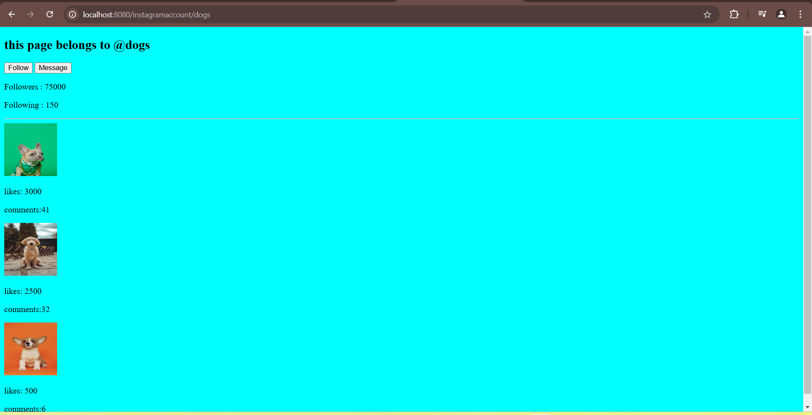

This is practise files of EJS ans Express.
Created a very basic sample instagram template using Ejs
In Index.js file
we are importing express
const express=require("express");
next we are storing the return value from express() in app variable
const app=express();
given port number as 8080
let port=8080
continuously listening to the port number
app.listen(port,()=>//continuosuly listening to the port number
{
    console.log(`listening to port ${port}`);
});
setting views folder which contains templates file like instagram.ejs in our example that is ejs files
app.set("viewengine","ejs");
this line is for to run the files even from the parent directory of current working directory.here,__dirname gives the current working directory to which we are adding views folder.
app.set("views",path.join(__dirname,"/Views"));
to execute the above one we have used path, we must require it
const path=require("path")
creating routing as /instagramaccount/:accountname where accountname is  a varible
as we need to get the data from the database , first we are requiring the file which contains database
const database=require("/data.json");
now we are storing it in data 
const data=satabase[accountname]
for example if we are passing as dogs,it stores info related to dogs , if cats then related to cats info
we can check this by printing in our console using console.log(data)
and we are using render method to respond , to respond with the large files we use render
and we are passing parameter as data.
app.get("/instagramaccount/:accountname",(req,res)=>
{
    let {accountname}=req.params;
    const database=require("./data.json");
    
    const data=database[accountname];//storing here the account name we are passing
    console.log(data);
    res.render("instagram.ejs",
        {data}
    );
});

